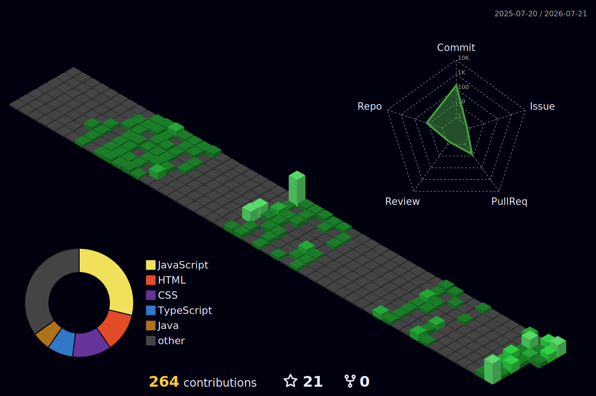

  

<h1 align="center">
  
</h1>

  

---

# 👋 About Me

- 🎓 **B.Tech CSE Student** at Ramdeobaba University, Nagpur
- 💻 Passionate about **Software Development & Open Source**
- 🌱 Currently learning **React, Spring Boot & AWS**
- 🚀 Solving **DSA** and building real-world projects
- 📫 Reach me at **aryanlade55@gmail.com**

---

# 🛠️ Languages & Tools

  

---

# 🌳 3D Contribution Graph

  

---

# 📊 GitHub Analytics

  

---

# 🌐 Connect With Me

  
  &nbsp;&nbsp;

  
  &nbsp;&nbsp;

  
  &nbsp;&nbsp;

  
  &nbsp;&nbsp;

  

---

  ⭐ <b>Thanks for visiting my profile!</b> ⭐

