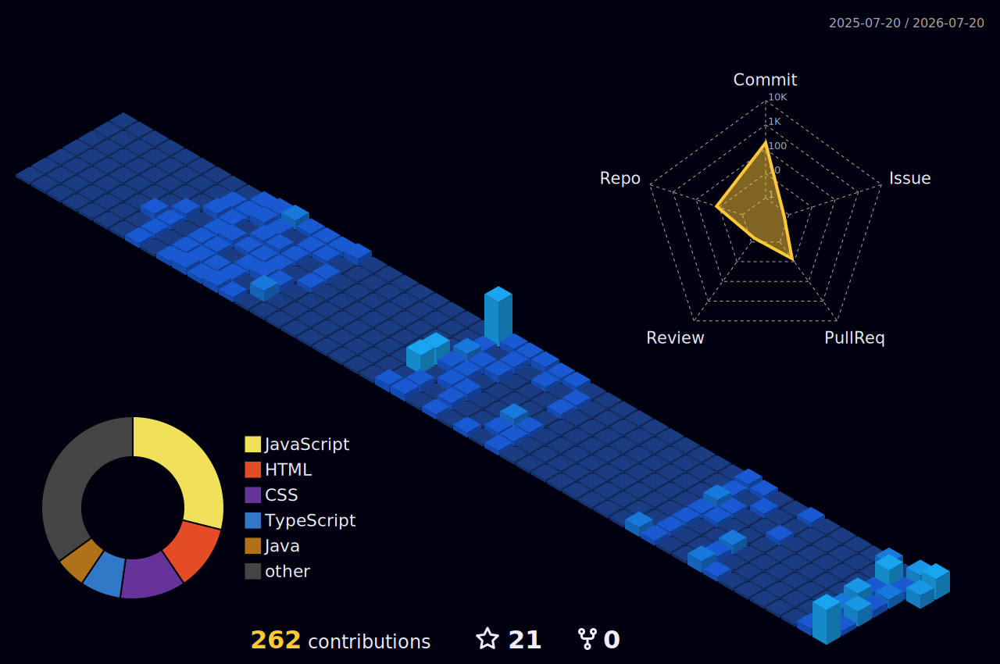

  

<h1 align="center">
  
</h1>

  

---

# 👋 About Me

- 🎓 B.Tech CSE Student at **Ramdeobaba University, Nagpur**
- 💻 Passionate about **Software Development & Open Source**
- 🌱 Currently learning **React, Spring Boot & AWS**
- 🚀 Solving DSA and building real-world projects
- 📫 **aryanlade55@gmail.com**

---

# 🛠️ Languages & Tools

---

# 🌃 3D Contribution Graph

---

# 📊 GitHub Stats

---

# 🏆 GitHub Trophies

---

# 📈 Contribution Graph

---

# 🌐 Connect With Me

---

⭐ Thanks for visiting my profile! ⭐

